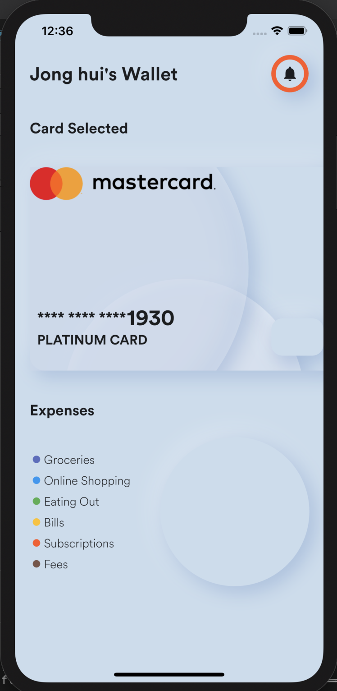

# amazing-ui-my wallet

<div>

</div>

## 알게된 것들

- Align() class: 부모요소 안의 자식 요소를 어떻게 위치시킬것인지. Center가 아닌 우하방, 좌상방 등 결정할 수 있음.

```dart
Container(
    child: Align(
        alignment: Alignment.bottomRight,
        child: Text('Hello!'),
    ),
);
```

### 유튜브 채널

[Sanskar Tiwari](https://www.youtube.com/watch?v=Zz0IKZBnk_Y)
