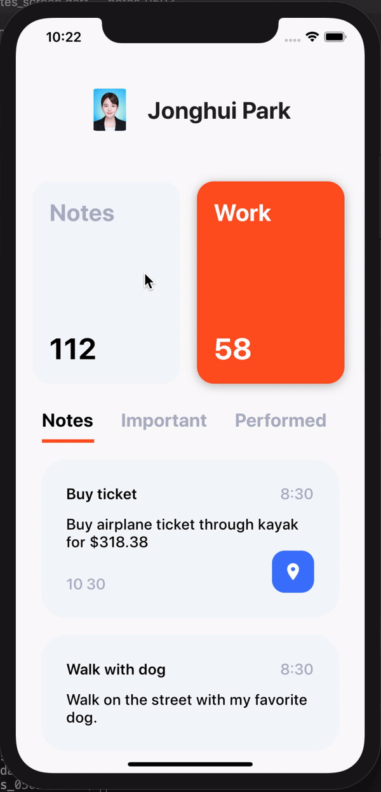

# notes_0503

notes

## 배운 점 요약

### package update import

- flutter의 색상 설정은 argb Color(0xFF2196F3) 혹은 Colors.blue 로 설정. 라인 맨 왼쪽에 색상이 표시됨. vs코드.
- package update할 때는, pubspec.yaml에 작성하고 flutter packages get 해줘서 변경사항 적용해주기
- 아이템들 간에 간격을 설정해줄때 SizedBox를 사용하기도 한다. 이 유튜버의 스타일일수도.
- Text() 안에 TextStyle()
- EdgeInsets.symmetric(vertical: 20.0, horizontal: 10.0)는 상하좌우에 대한 margin이나 padding 등 값을 설정할때 대칭적으로 적용하는 코드.
