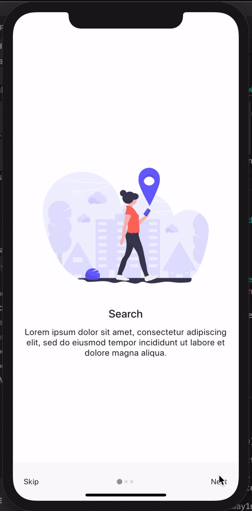

# onboarding_0502

5m 2d theme: onboading slides

<div>

</div>

## 배운 점 요약

### PageView.builder constructor

- PageView.builder

```dart
PageView.builder(
{Key key,
Axis scrollDirection: Axis.horizontal,
bool reverse: false,
PageController controller,
ScrollPhysics physics,
bool pageSnapping: true,
ValueChanged<int> onPageChanged,
@required IndexedWidgetBuilder itemBuilder,
int itemCount,
DragStartBehavior dragStartBehavior: DragStartBehavior.start}
)
```

### Scaffold constructors의 프로퍼티

- appBar
- backgroundColor
- body
- bottomNavigationBar
- bottomSheet
- drawer
- drawerDragStartBehavior
- drawerEdgeDragWidth
- drawerScrimColor
- endDrawer
- extendBody
- extendBodyBehindAppBar
- floatingActionButton
- floatingActionButtonAnimator
- floatingActionButtonLocation
- persistentFooterButtons
