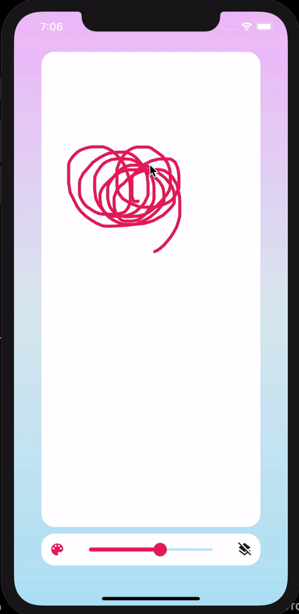

# paint_app_0507

<div>

</div>

## 배운 점

- container에 배경색 설정하려면,

```dart
decoration: BoxDecoration(
                    color: Colors.white,
                    borderRadius: BorderRadius.all(
                      Radius.circular(20.0),
                    ))
```

- backgroundColor 이런거 없음.
- crossAxisAlignment, mainAxisAlignment는 Row, Column의 프로퍼티다. Contariner 등에 적용 X
