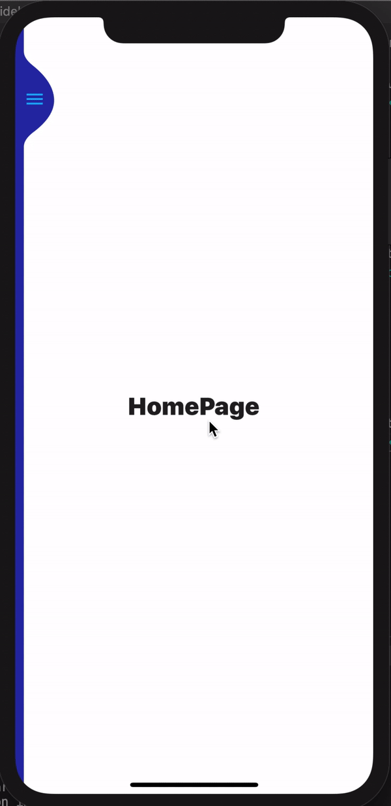

# sidebar_animation_navigation_0504

## Getting Started

- Row()는 children을 수평정렬한다.
- expanded는 나머지 공간을 채운다.
- wrap with widget shortcut: control + shift + R
- Positioned 위젯은 Stack 위젯의 자식요소의 위치를 정하는데 사용됨. AnimatedPositioned도 있다.
- ERRPR: type 'SideBar' is not a subtype of type 'StatelessWidget'는 stateless에서 stateful로 변경 후 재시작을 해주어야한다. R!!!! initState()는 restart시에만 콜되기 때문이다.
- anaimation 변경 후도 마찬가지다.
